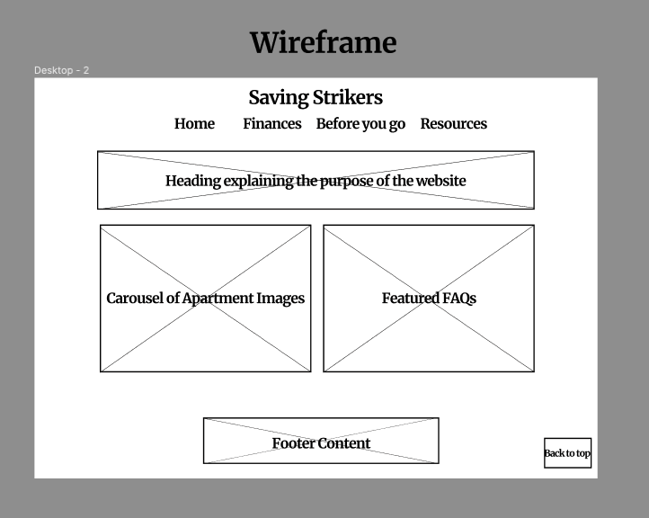
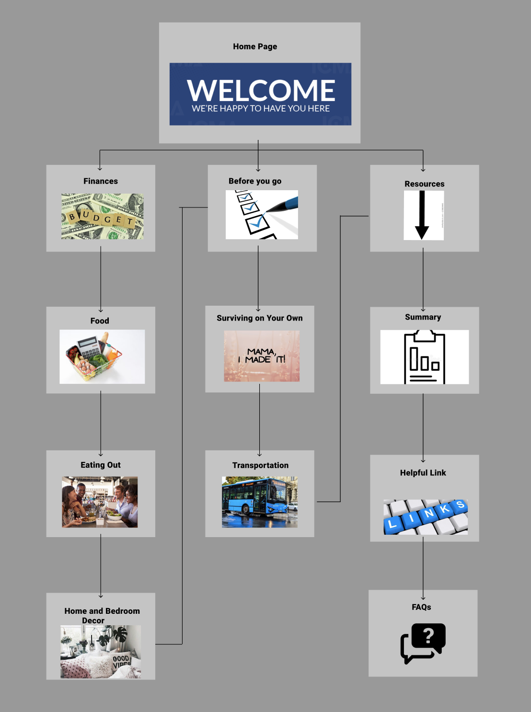

# Saving-Strikers 💰🐍

## Purpose of website

To act as a resource to guide college students moving off campus for the first time.

## Target Audience

Independent college students.

## Graphics

Apartment complexes, Money, and various other images that will reflect what the page is talking about.

## Color

Any colors that will not hinder those with a disability.

## Accessibility

We will be using light and dark colors to make it somewhat visible for different types of color blind.
There will be a section designated for people with disabilities, since their expenses will be different.
We will have the option to have text be read out loud by the computer.

## Project Timeline

About two weeks per page. That includes planning, the implementation, and testing on different devices.

# Content Ideas

1. Finances

   1. Budgeting
   2. Paying Rent
   3. Saving for the unprecedent

2. Before for go off campus

   1. Apartment Picking
   2. Living by your means
   3. Transportation

3. Back up plans

   1. Having a plan A,B,C,etc

4. FAQs
   1. Questions that have not already been answered within the ideas discussed above

# Wireframe

# Site Map

